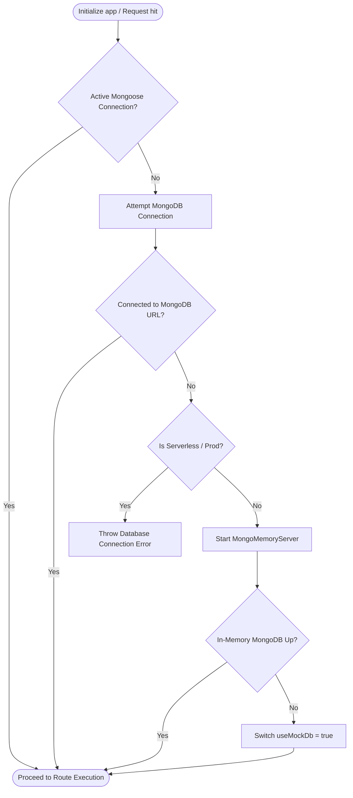
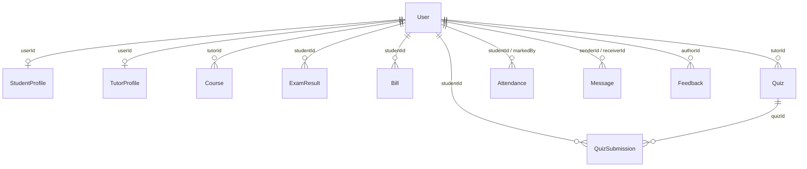
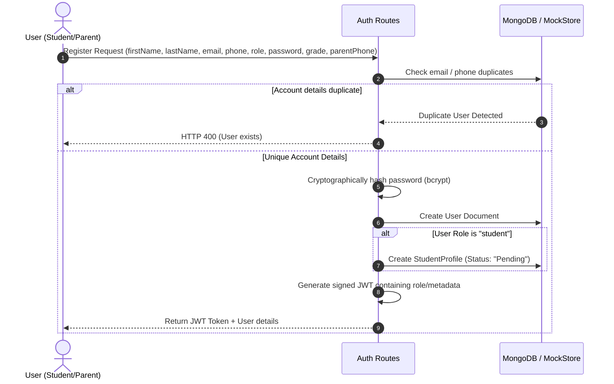
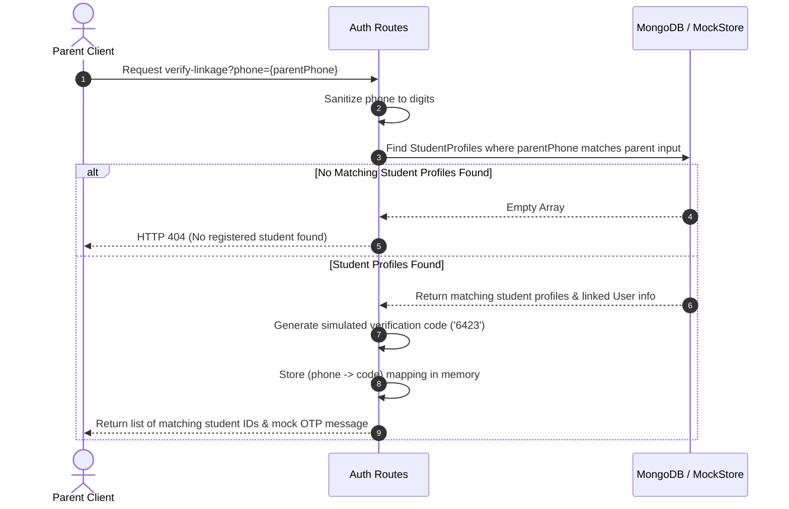
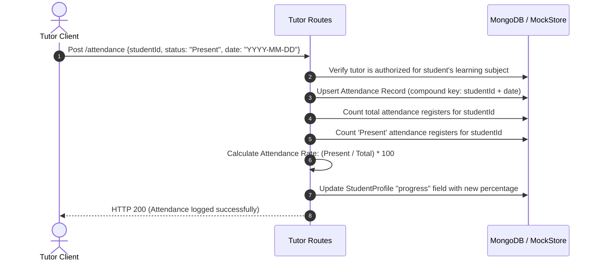
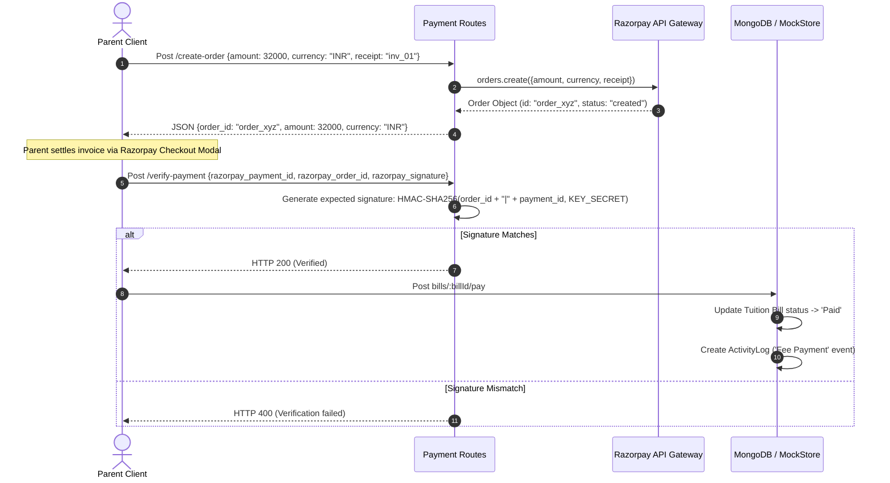
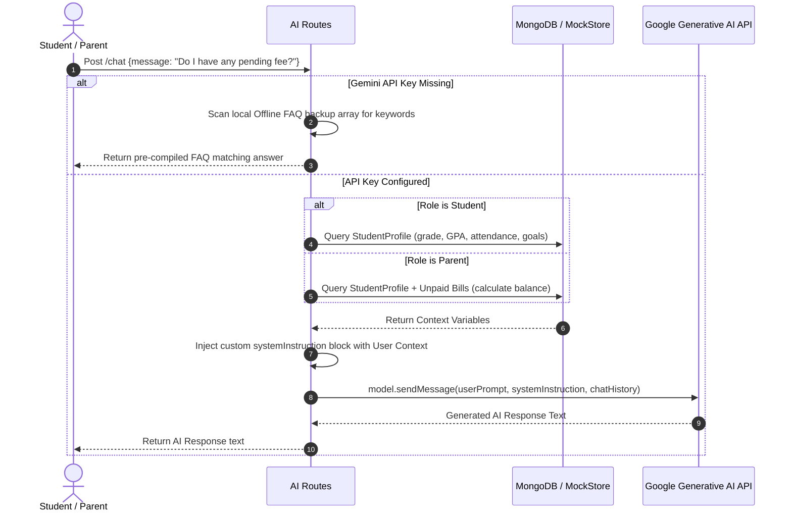

# Tutor CRM: Database and Data Flow Understanding

This document provides a comprehensive analysis and reference guide for the **Tutor CRM Backend** database design, server configurations, data routing models, and internal operational flows.

---

## 1. Database Connection & Triple-Fallback Architecture

The backend application features a highly resilient database connection strategy designed to ensure server availability under various execution contexts (Vercel serverless functions, local development, offline mode).



### Connection Strategy Details
1. **Primary MongoDB Conn**: Initial connection attempts are made using standard connection strings configured via `DATABASE_URL` (with an adjustable connection timeout depending on serverless or node environments).
2. **In-Memory Server Fallback (`MongoMemoryServer`)**: In local development, if connection to the database URL fails, the system automatically starts an ephemeral MongoDB database instance.
3. **Mock Store Fallback (`mockStore`)**: If memory-based MongoDB server execution fails, the application switches to `useMockDb = true`, using a proxy wrapper over raw memory arrays mimicking Mongoose queries.

---

## 2. Database Models & Schema Specifications

The backend handles exactly **14 collections/models** using Mongoose schemas. Each model is encapsulated with a proxy wrapper (`createModelProxy`) enabling transparent fallback to mock memory storage if Mongoose isn't connected.

### Model Relationships



### Table Schema Definitions

#### 1. User
Represents base login credentials and demographic details for all system participants.
* **Fields**:
  * `email` (String, Required, Unique, Indexed)
  * `passwordHash` (String, Required)
  * `role` (String, Enum: `['admin', 'tutor', 'student', 'parent']`, Required)
  * `firstName` (String, Required)
  * `lastName` (String, Required)
  * `phone` (String, Required, Unique, Indexed)
  * `createdAt` / `updatedAt` (Timestamps)

#### 2. StudentProfile
Stores student-specific academic information, attendance progress, enrollment status, and parent link references.
* **Fields**:
  * `userId` (ObjectId, Reference: `User`, Required, Unique)
  * `grade` (String, Default: `'11th Grade'`)
  * `learningGoal` (String, Default: `''`)
  * `parentPhone` (String, Default: `''`) - Used to link parent dashboard queries.
  * `avgGrade` (Number, Default: `3.5`) - Computed average GPA.
  * `progress` (Number, Default: `60`) - Represents the dynamic attendance percentage rate.
  * `status` (String, Enum: `['Active', 'Pending', 'Inactive']`, Default: `'Active'`)

#### 3. TutorProfile
Captures tutor qualifications, subjects of specialization, schedule status, and internal metrics.
* **Fields**:
  * `userId` (ObjectId, Reference: `User`, Required, Unique)
  * `subject` (String, Required)
  * `experience` (String, Required)
  * `status` (String, Enum: `['Active', 'On Leave']`, Default: `'Active'`)
  * `courses` (Array of Strings, Default: `[]`)
  * `salaryStatus` (String, Enum: `['Credited', 'Pending']`, Default: `'Pending'`)
  * `attendance` (String, Default: `'95%'`)

#### 4. Course
Defines instructional curricula offered, mapped to a registered instructor.
* **Fields**:
  * `name` (String, Required)
  * `tutorName` (String, Required)
  * `tutorId` (ObjectId, Reference: `User`, Required)
  * `schedule` (String, Required)
  * `iconType` (String, Enum: `['math', 'physics', 'lit', 'chem']`, Required)
  * `progress` (Number, Default: `60`)
  * `room` (String, Default: `''`)
  * `status` (String, Enum: `['Active', 'Upcoming', 'Draft']`, Default: `'Active'`)
  * `level` (String, Default: `'Grade 11-12'`)

#### 5. ExamResult
Evaluations and assignments scores compiled by tutors for registered students.
* **Fields**:
  * `studentId` (ObjectId, Reference: `User`, Required, Indexed)
  * `examName` (String, Required)
  * `date` (String, Required)
  * `score` (Number, Required)
  * `maxScore` (Number, Required)
  * `teacherNotes` (String, Default: `''`)

#### 6. ExamSchedule
Global calendar planner entries mapping examination venues and deadlines.
* **Fields**:
  * `name` (String, Required)
  * `date` (String, Required)
  * `time` (String, Required)
  * `location` (String, Required)
  * `type` (String, Enum: `['Midterm', 'Quiz']`, Required)

#### 7. Tuition Bill
Invoices issued to parents/students tracking balances due and secure payment transactions.
* **Fields**:
  * `studentId` (ObjectId, Reference: `User`, Required, Indexed)
  * `itemName` (String, Required)
  * `paidDate` (String, Default: `'-'`)
  * `amount` (Number, Required)
  * `status` (String, Enum: `['Paid', 'Pending', 'Overdue']`, Default: `'Pending'`)

#### 8. Quiz
Structured multiple-choice quizzes created by tutors.
* **Fields**:
  * `title` (String, Required)
  * `subject` (String, Required)
  * `questionsCount` (Number, Required)
  * `tutorId` (ObjectId, Reference: `User`, Required)
  * `questions` (Array of Sub-documents):
    * `id` (Number, Required)
    * `text` (String, Required)
    * `options` (Array of Strings, Required)
    * `correctAnswer` (String, Enum: `['A', 'B', 'C', 'D']`, Required)

#### 9. QuizSubmission
Answers submitted by students, listing scores and aggregate totals.
* **Fields**:
  * `quizId` (ObjectId, Reference: `Quiz`, Required)
  * `studentId` (ObjectId, Reference: `User`, Required)
  * `answers` (Mixed / Map-like, Required) - e.g., `{ 1: 'A', 2: 'C' }`
  * `score` (Number, Required)
  * `total` (Number, Required)
  * `submittedAt` (Date, Default: `Date.now`)

#### 10. Attendance
Daily attendance registers logged by classroom instructors.
* **Fields**:
  * `studentId` (ObjectId, Reference: `User`, Required, Indexed)
  * `date` (String, Required) - e.g. `'YYYY-MM-DD'`
  * `status` (String, Enum: `['Present', 'Absent', 'Excused']`, Required)
  * `markedBy` (ObjectId, Reference: `User`, Required)
* **Constraints**: Compound unique index enforced on `[studentId + date]` to prevent duplicate logs.

#### 11. ActivityLog
Audit records tracking administrative changes, fee operations, and class status changes.
* **Fields**:
  * `studentName` (String, Required)
  * `initials` (String, Default: `''`)
  * `type` (String, Enum: `['New Enrollment', 'Fee Payment', 'Session Scheduled', 'Payment Failed']`, Required)
  * `detail` (String, Required)
  * `dateTime` (String, Required)
  * `amount` (Number, Optional)
  * `status` (String, Enum: `['Active', 'Completed', 'Pending', 'Failed']`, Required)

#### 12. Message
Chat logs enabling asynchronous communication between students/parents and educational staff.
* **Fields**:
  * `senderId` (ObjectId, Reference: `User`, Required, Indexed)
  * `receiverId` (ObjectId, Reference: `User`, Required, Indexed)
  * `text` (String, Required)
  * `timestamp` (Date, Default: `Date.now`)

#### 13. Announcement
Global news posts displayed across dashboard feeds.
* **Fields**:
  * `title` (String, Required)
  * `content` (String, Required)
  * `timeAgo` (String, Required)
  * `iconType` (String, Enum: `['event', 'celebration', 'info']`, Required)
  * `createdAt` (Date, Default: `Date.now`)

#### 14. Feedback
Quality logs and ratings submitted by parents or students regarding instruction.
* **Fields**:
  * `authorId` (ObjectId, Reference: `User`, Required)
  * `authorRole` (String, Enum: `['student', 'parent']`, Required)
  * `authorName` (String, Required)
  * `feedback` (String, Required)
  * `rating` (Number, Min: 1, Max: 5, Required)
  * `submissionDate` (String, Required)
  * `status` (String, Enum: `['Reviewed', 'Pending']`, Default: `'Pending'`)
  * `createdAt` / `updatedAt` (Timestamps)

---

## 3. Core Functional Data Flows

### A. Authentication & Onboarding Flow
When a user attempts registration or sign-in, the auth flow manages verification state based on role hierarchies.



### B. Student-Parent Verification & Linkage Flow
Parent onboarding leverages a custom OTP lookup to securely establish relationships without complex lookup tables.



### C. Attendance Tracking & Progress Update Flow
Tutors record attendance, which updates both history registers and dynamic profile indicators in a single transaction path.



### D. Razorpay Invoice Settlement Flow
Billing settlements integrate order creation, signature validation, and audit trail updates.



### E. Gemini AI Chat Context Flow
Inquiries directed to the built-in AI tutor dynamically collect operational variables, tailoring the context sent to Gemini.



---

## 4. Endpoint Routing Directory & Access Reference

All routes under `/api/admin`, `/api/tutor`, `/api/student`, `/api/parent`, `/api/messages`, and `/api/ai` require authentication headers via the `authenticateToken` middleware, which decodes the bearer token and mounts the user onto `req.user`.

| Service Prefix | Method | Endpoint URL | Required Role | DB Model(s) Involved | Description |
| :--- | :--- | :--- | :--- | :--- | :--- |
| **Auth** | `GET` | `/api/auth/verify-linkage` | Public | `StudentProfile`, `User` | Verifies parent phone matching unregistered student phone list, returns mock OTP `6423`. |
| | `POST` | `/api/auth/register` | Public | `User`, `StudentProfile` | Registers a parent or student user, sets student profile to `Pending`. |
| | `POST` | `/api/auth/login` | Public | `User`, `StudentProfile` | Checks credentials, validates if student profile status is `Active`, issues JWT. |
| | `GET` | `/api/auth/me` | Anyone | `User` | Fetches session validation profile variables. |
| **Admin** | `GET` | `/api/admin/metrics` | `admin` | `User`, `StudentProfile`, `ActivityLog`, `Bill` | Gets general analytics dashboard stats. |
| | `GET` | `/api/admin/students` | `admin` | `User`, `StudentProfile` | List and search user student accounts and active statuses. |
| | `POST` | `/api/admin/students/enroll` | `admin` | `User`, `StudentProfile`, `ActivityLog` | Directly registers and enrolls a student user as `Active`. |
| | `GET` | `/api/admin/activities` | `admin` | `ActivityLog` | Returns 50 most recent operational logs. |
| | `GET` | `/api/admin/teachers` | `admin` | `User`, `TutorProfile` | Renders list of tutors, classes, and experience. |
| | `POST` | `/api/admin/students/:id/approve`| `admin` | `User`, `StudentProfile`, `ActivityLog` | Accepts (`Active` status) or declines (delete account) user registrations. |
| | `GET` | `/api/admin/students/:id` | `admin` | `User`, `StudentProfile`, `Bill`, `ActivityLog` | Returns profile details, bills ledger, and logs for a single student. |
| | `PUT` | `/api/admin/students/:id` | `admin` | `User`, `StudentProfile` | Modifies student contact, profile grade, or enrollment status. |
| | `DELETE`| `/api/admin/students/:id` | `admin` | `User`, `StudentProfile`, `Bill` | Deletes user record, child profile, and bills. |
| | `POST` | `/api/admin/tutors` | `admin` | `User`, `TutorProfile` | Creates a new tutor profile. |
| | `GET` | `/api/admin/tutors/:id` | `admin` | `User`, `TutorProfile` | Detailed view of a single tutor. |
| | `PUT` | `/api/admin/tutors/:id` | `admin` | `User`, `TutorProfile` | Modifies tutor contact and assigned courses. |
| | `DELETE`| `/api/admin/tutors/:id` | `admin` | `User`, `TutorProfile` | Deletes tutor account and credentials. |
| | `GET` | `/api/admin/parents` | `admin` | `User`, `StudentProfile`, `Bill` | Detailed directory of registered and unregistered parent phone connections. |
| | `POST` | `/api/admin/parents` | `admin` | `User`, `StudentProfile` | Pre-creates a parent account and links existing student profiles. |
| | `PUT` | `/api/admin/parents/:id` | `admin` | `User` | Edits parent credentials and phone link. |
| | `DELETE`| `/api/admin/parents/:id` | `admin` | `User` | Deletes parent account credentials. |
| | `GET` | `/api/admin/courses` | `admin` | `Course` | Lists all classes. |
| | `POST` | `/api/admin/courses` | `admin` | `User`, `Course` | Registers new instructional courses. |
| **Tutor** | `GET` | `/api/tutor/students` | `tutor` | `TutorProfile`, `StudentProfile`, `User` | Filters and returns student user profile details matching tutor's subjects. |
| | `POST` | `/api/tutor/attendance` | `tutor` | `Attendance`, `StudentProfile`, `User` | Marks attendance status, triggers dynamic recalculation of student profile progress. |
| | `POST` | `/api/tutor/assignments/grade` | `tutor` | `StudentProfile`, `TutorProfile`, `ExamResult` | Records a graded evaluation, triggers average GPA conversion update on StudentProfile. |
| | `POST` | `/api/tutor/quizzes/publish` | `tutor` | `Quiz` | Publishes modular educational quiz. |
| | `POST` | `/api/tutor/lectures/schedule` | `tutor` | `ExamSchedule` | Schedules a calendar review session or quiz. |
| | `GET` | `/api/tutor/profile` | `tutor` | `TutorProfile` | Returns tutor curriculum profile records. |
| **Student**| `GET` | `/api/student/dashboard` | `student` | `StudentProfile`, `Course`, `ExamResult`, `ExamSchedule`, `Quiz`, `Attendance` | Compiles global dashboard profile package for the student. |
| | `POST` | `/api/student/quizzes/:quizId/submit`| `student`| `Quiz`, `QuizSubmission` | Scores submission answers and registers quiz result. |
| | `GET` | `/api/student/feedback` | `student` | `Feedback` | View quality submissions. |
| | `POST` | `/api/student/feedback` | `student` | `Feedback` | Submits educational review feedback. |
| **Parent** | `GET` | `/api/parent/dashboard` | `parent` | `StudentProfile`, `Announcement`, `Attendance`, `Course`, `TutorProfile` | Returns progress overview, announcements, and schedules for the linked child. |
| | `GET` | `/api/parent/bills` | `parent` | `StudentProfile`, `Bill` | Gets billing ledger; auto-seeds sample dues if empty. |
| | `POST` | `/api/parent/bills/:billId/pay` | `parent` | `Bill`, `ActivityLog` | Completes billing settlement, logs UPI transaction details. |
| | `GET` | `/api/parent/feedback` | `parent` | `Feedback` | Retrieves parent-authored service evaluations. |
| | `POST` | `/api/parent/feedback` | `parent` | `Feedback` | Submits feedback and star ratings. |
| **Messages**|`GET` | `/api/messages/:otherUserId` | Anyone | `Message` | Lists message history sorted chronologically. |
| | `POST` | `/api/messages/send` | Anyone | `Message`, `User` | Dispatches chat text; triggers simulated replies if receiver is a tutor. |
| **Payment**|`GET` | `/api/razorpay-key` | Anyone | None | Returns Razorpay credential keys. |
| | `POST` | `/api/create-order` | Anyone | None | Creates Razorpay order session. |
| | `POST` | `/api/verify-payment` | Anyone | None | Validates HMAC signature hashes of paid receipts. |
| **AI** | `POST` | `/api/ai/chat` | Anyone | `StudentProfile`, `Bill` | Dialog engine feeding local database context parameters directly to Gemini. |

---

## 5. Offline Fallback Mechanics (Proxy Engine)

When database calls fail, the custom proxy dynamically routes mongoose query abstractions to in-memory datasets (`src/models/mockStore.ts`):

1. **Proxy Injection (`createModelProxy`)**:
   ```typescript
   const createModelProxy = (modelName: string, mongooseModel: any) => {
     return new Proxy(mongooseModel, {
       get(target, prop, receiver) {
         if (useMockDb) {
           const mockModel = (mockStore as any)[modelName];
           if (mockModel && prop in mockModel) {
             return mockModel[prop];
           }
         }
         return Reflect.get(target, prop, receiver);
       }
     });
   };
   ```
2. **Chainable Mongoose Emulators**: 
   The mock store implements chainable builders for query methods (such as `.find()`, `.findOne()`, `.sort()`, `.limit()`, `.lean()`, and `.populate()`). These chainable builders ensure that controller endpoints written for Mongoose run seamlessly without database crashes.
